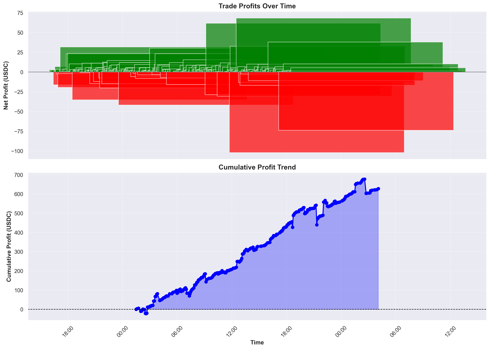
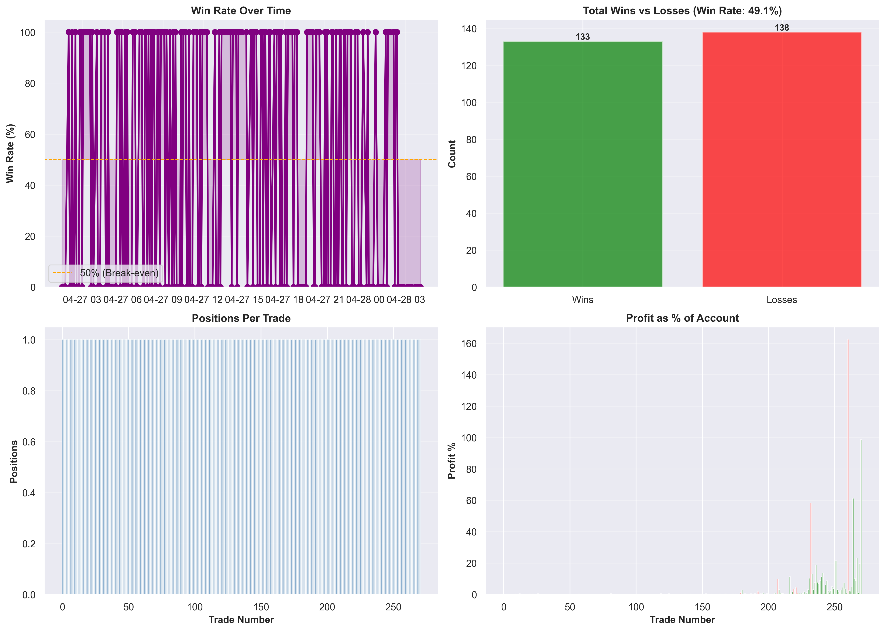
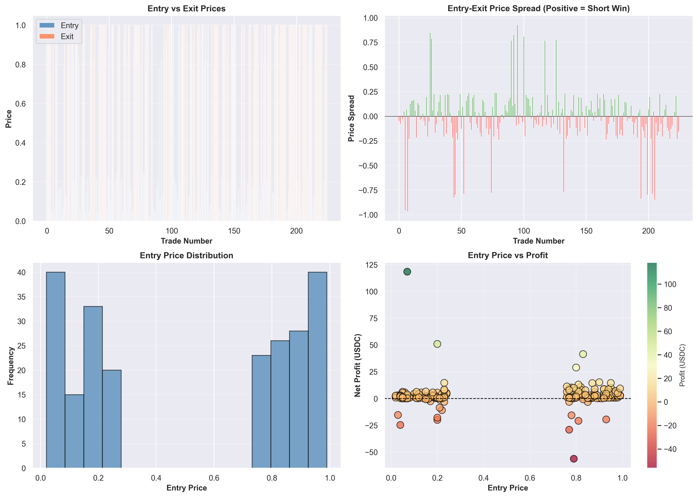
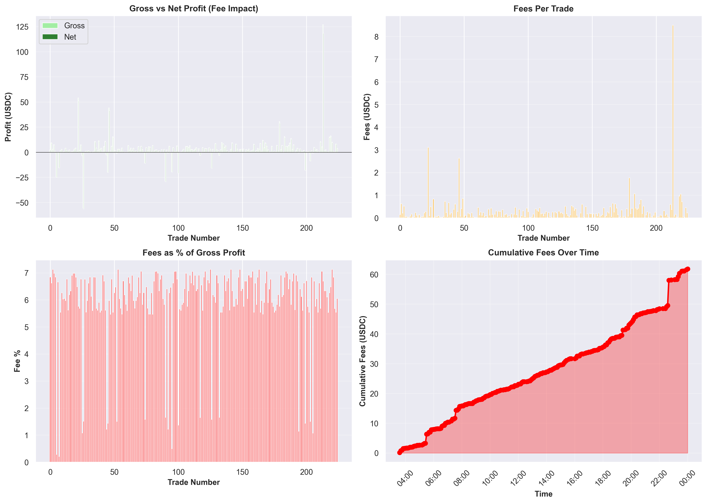
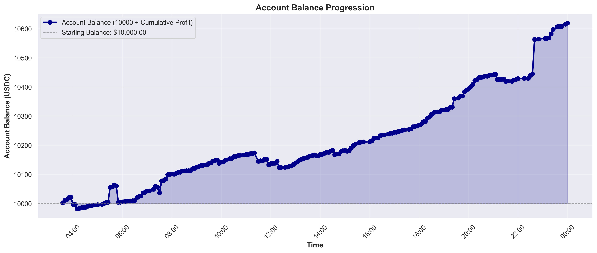
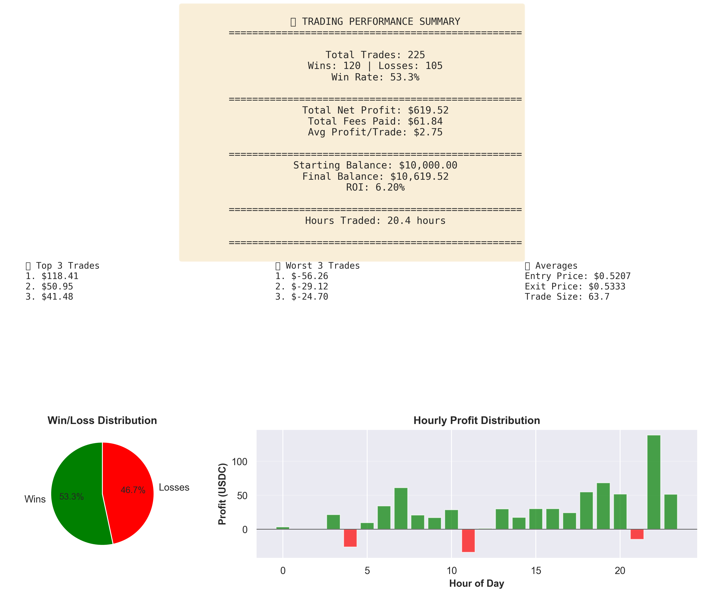

# Janus - Polymarket 5-Minute Bot

A high-performance prediction market bot built in Go for trading 5-minute crypto markets on Polymarket using the CLOB API.

## Features

- **Concurrent API calls** using Go goroutines for maximum performance
- **Market data polling** every 5 seconds for low-latency market tracking
- **Paper trading simulation** for strategy testing without risking capital
- **Live order placement** capability (when ready to deploy)
- **Modular architecture** for easy strategy implementation

## Project Structure

```
janus-bot/
├── cmd/
│   └── bot/
│       └── main.go           # Entry point
├── pkg/
│   ├── polymarket/
│   │   └── client.go         # Polymarket CLOB API client
│   ├── market/
│   │   └── fetcher.go        # Market data fetching & caching
│   └── trading/
│       └── paper_trading.go  # Paper trading simulation engine
├── config/
│   └── variables.go          # Static configuration & market definitions
├── go.mod                    # Go module definition
├── go.sum                    # Go dependencies checksum
└── README.md
```

## Configuration

### 1. Market Configuration

Edit `config/variables.go` to add your market IDs and trading parameters:

```go
Markets: []MarketConfig{
    {
        MarketID:           "YOUR_MARKET_ID",
        Symbol:             "BTC-5M",
        TimeframeMinutes:   5,
        MinPositionSize:    10.0,
        MaxPositionSize:    1000.0,
        LiquidityThreshold: 5000.0,
    },
    // Add more markets...
}
```

### 2. Environment Variables

Create a `.env` file or set environment variables:

```bash
export POLYMARKET_API_KEY=your_api_key
export POLYMARKET_PRIVATE_KEY=your_private_key
```

### 3. Trading Mode

By default, the bot runs in **paper trading mode** (simulated trades). To enable live trading:

- Change `PaperTradingEnabled: false` in `config/variables.go`
- Implement the live trading engine in `pkg/trading/`

## Building & Running

### Prerequisites

- Go 1.21 or later
- Internet connection for API access

### Build

```bash
go build -o janus-bot ./cmd/bot
```

### Run

```bash
./janus-bot
```

### Development (Direct run)

```bash
go run ./cmd/bot
```

## API Endpoints Used

### Polymarket CLOB API

- `GET /book?market_id={id}` - Get order book
- `POST /orders` - Place order
- `DELETE /orders/{id}` - Cancel order
- `GET /orders?market_id={id}` - Get open orders
- `GET /positions` - Get current positions

## Architecture

### Market Data Flow

1. **MarketFetcher** polls Polymarket CLOB API every 5 seconds
2. Data is cached in **MarketDataCache** (concurrent-safe with RWMutex)
3. Strategies read from cache without adding API calls
4. All market IDs from config are fetched in parallel

### Trading Flow (Paper Trading)

1. Strategy calls `EvaluateV2()` returning market and liquidity data
2. Engine applies realistic execution modeling:
   - **Slippage** based on liquidity taken (0.5 bps per 1% by default)
   - **Latency** simulation (100-500ms delays)
   - **Price staleness** from polling intervals (up to 50 bps movement)
3. Trade is recorded with realistic execution price
4. Position is updated or created
5. Trade history includes fees (Polymarket formula: C × 0.072020 × p × (1-p))

**Realism Features:**
- Execution prices reflect real market impact
- Timestamps include network/exchange delays
- Backtests typically 10-30% more conservative than unrealistic simulations
- Configurable per `config.PaperTradingRealistic`

See [PAPER_TRADING_REALISM.md](./PAPER_TRADING_REALISM.md) for detailed documentation on realism features.

## Adding Strategies

Create a new file in `pkg/strategies/`:

```go
package strategies

type YourStrategy struct {
    fetcher *market.MarketFetcher
    engine  interface{} // *trading.PaperTradingEngine or *trading.LiveTradingEngine
}

func NewYourStrategy(f *market.MarketFetcher, e interface{}) *YourStrategy {
    return &YourStrategy{fetcher: f, engine: e}
}

func (s *YourStrategy) Run() {
    // Strategy logic here
}
```

## Performance Notes

- **Go goroutines** handle concurrent API calls efficiently
- **Memory pooling** for high-frequency market updates
- **Lock contention** minimized with RWMutex for read-heavy operations
- Typical latency: < 100ms from API to strategy signal

## Performance Analysis & Visualization

The bot includes a comprehensive Python-based visualization tool that generates detailed performance analytics from trading logs.

### Available Charts

#### 📈 Profit Timeline
Cumulative profit over time with trade markers showing wins (green) and losses (red)



#### 🎯 Win Rate Analysis
Win/loss distribution, cumulative win rate, and trading frequency breakdown



#### 💰 Price Analysis
Entry/exit price distributions for UP and DOWN positions with statistical overlays



#### 💸 Fee Analysis
Fee patterns by trade type and cumulative fee impact on profitability



#### 📊 Account Balance
Account balance progression starting from $10,000 with drawdown analysis



#### 📋 Summary Statistics
Key metrics: total trades, win rate, ROI, hours traded, fees, and P&L breakdown



### Quick Start

Generate visualization charts from trading logs:

```bash
python tools/visualize_performance.py logs/markets/YOUR_LOG/market_performance.csv --output charts
```

For detailed setup and usage:
- **Quick Start**: See [`tools/VISUALIZATION_QUICKSTART.md`](./tools/VISUALIZATION_QUICKSTART.md)
- **Full Guide**: See [`tools/README.md`](./tools/README.md)
- **Quick Reference**: See [`tools/QUICK_REFERENCE.py`](./tools/QUICK_REFERENCE.py)

### Requirements

Python 3.8+ with dependencies specified in `tools/requirements-analysis.txt`:
- matplotlib ≥ 3.6 (charting)
- seaborn ≥ 0.12 (statistical visualization)
- pandas ≥ 1.5 (data manipulation)
- numpy < 2.0 (numerical computing)

## Next Steps

1. Add your Polymarket market IDs to `config/variables.go`
2. Set environment variables with API credentials
3. Test with paper trading
4. Implement trading strategy in new strategy file
5. Monitor performance with visualization tools (see Performance Analysis section above)
6. Deploy to production when ready

## Troubleshooting

- **API errors**: Check API credentials and market IDs
- **No market data**: Verify markets exist and are active on Polymarket
- **Balance insufficient**: Check starting balance in paper trading or account balance in live mode
- **Network timeouts**: Increase timeout in `polymarket/client.go`

## License

MIT
